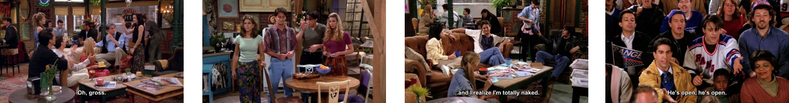

# Transfer & Active Learning for Faster R-CNN
KAIST Active Learning for VTT

# Pytorch Implementation of Transfer & Active Learning for Faster R-CNN

This repository is based on [Pytorch Implementation of Faster R-CNN](https://github.com/jwyang/faster-rcnn.pytorch).

Requirements
------------

* Python 2.7 or 3.x
* Pytorch 0.4.0 or higher

Preparation
--------

###Pretrained model
1. Download pretrained model [here](https://github.com/jwyang/faster-rcnn.pytorch#pretrained-model).
2. Put them into 'data/pretrained_model/'.

###Compile the cuda dependencies.
	
	pip install -r requirements.txt
	cd lib
	sh make.sh

Train
------
	python trainval_net_AL_poolbased.py --cuda

Validation
-------
	python test_net.py --cuda

Results
------
High-entropy queries

Low-entropy queries

Citations
----------
	@article{jjfaster2rcnn,
	    Author = {Jianwei Yang and Jiasen Lu and Dhruv Batra and Devi Parikh},
	    Title = {A Faster Pytorch Implementation of Faster R-CNN},
	    Journal = {https://github.com/jwyang/faster-rcnn.pytorch},
	    Year = {2017}
	}
	
	@inproceedings{renNIPS15fasterrcnn,
	    Author = {Shaoqing Ren and Kaiming He and Ross Girshick and Jian Sun},
	    Title = {Faster {R-CNN}: Towards Real-Time Object Detection
	             with Region Proposal Networks},
	    Booktitle = {Advances in Neural Information Processing Systems ({NIPS})},
	    Year = {2015}
	}

